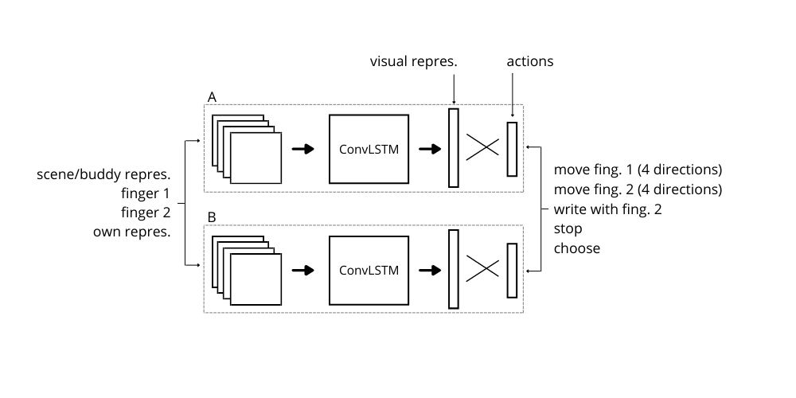
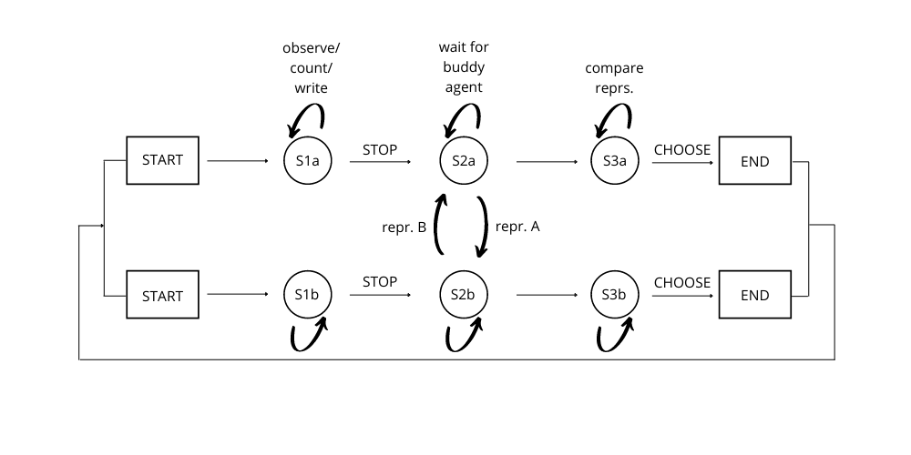

# RL communicating numbers

 


### Overall idea

The idea is to frame the  problem of learning the enumeration procedure as a  communication problem between two agents. The agents  need to communicate about the numerosity of two scenes   they are separately observing, and cooperatively solve a task which requires to compute exactly the number of   objects in the scenes, without being able to see both of them.

### Environment 

gym-like environment:
env.obs(), env.step(action), env.reset(), env.reward()

Simplest observation: objects represented by binaries:

```
max_objects = 9
n_objects = random.randint(1,max_objects)
dim = 4

obs = np.zeros((dim,dim))
obs.ravel()[np.random.choice(obs.size, max_objects, replace=False)] = 1

obs:
array([[0., 0., 0., 1.],
 [1., 0., 0., 1.],
 [0., 0., 0., 0.],
 [1., 0., 0., 0.]])
```


Once both agents said 'stop' the scene-channel (physical environment) is replaced by the external representation of the other agent.  
The external representation has the same dimensions as the scene-channel and is initialized with 0s. 


### Actions
- moving left/right/up/down in scene-channel or external repr. depending in which phase of the episode we are  
- touch/draw: binary at the current position switches from 0 to 1 when external representation is on
- stop
- choose 
- answer


choose at the same time step as the answer.

(?) Start out with simple action space: touch, stop and choose, answer. --> they will likely start subitizing instead of touching each of the objects?. 
answer space: two units representing larger/smaller or equal/different.

### NN-Architecture

ConvLSTM, CNN. Input, output dimensions dependent on obs-and action space. 
Any restrictions on the output? only one action at a time (-->softmax)? Otherwise letting the output freely take values between 0 and 1 e.g. with a sigmoid activation fct.

### RL-algorithm

Start with an rl-algorithm that is simple to implement. E.g. DQL for multi-agents?


### Task reward

**Start-out: environment contains either 0 or 1 objects (presence/absence):**

Final reward: when answer-action was correct.

What does it mean if one agent fails to answer correctly? wrong repr. of either of the two agents. or perfectly fine representations but wrong inference.

Punishment for action 'choose' before 'stop'. Or having the same node for them. Prefer the second option in the beginning.


**Later: enviroment can contain multiple objects** 

Final reward: when answer-action was correct.

Intermediate rewards: touching objects (?), no number words.
