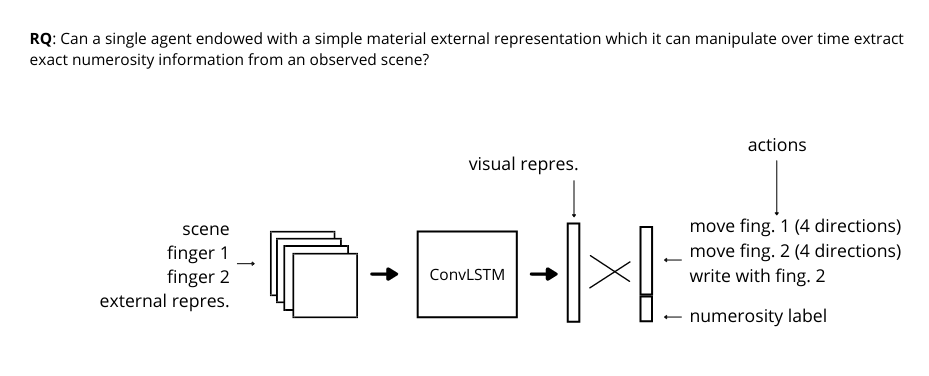
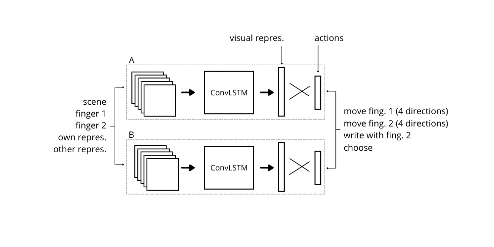

## First simpler model

The purpose of this model is to investigate the hypothesis that an agent endowed with a simple material external representation which it can manipulate over time is able to extract exact numerosity information from a scene. We therefore leave aside the elements of emergent communication and multi-agent interaction.

We have a **single agent** setting in which an embodied agent aims to extract information about the exact numerosity in observed scenes. As previously, the agent has **two hands/fingers** it can move over the observed scene and over a grid-like **material representation**. The agent can perform actions over time modifying its own environment, and stop the task at some point outputting a **vector** which should encode the number of objects in the scene (either 1-hot or binary encoded). The agent is **rewarded** when the vector is correct. Possibly, minor rewards could be given when agents touch objects in the scene. 
This model can be trained with DQL or Policy Gradient methods.

## Second more complex model

The purpose of this model is to investigate the previous scenario, with the introduction of the interaction between two agents, which need to build representation which are interpretable for both of them to collectively solve a task.

**Two agents** interact in a shared environment. The agents possess again **two fingers** and a **material representation**, but this time they both **observe** their own scene and the material representation of the other agent, other than their own representation. In this way, the environment observed by the agents changes less drastically within a single episode, and the agents don't need to "send" their own representation at some point in time (reduced action space). On the other hand, the dimensionality of the input increases, hopefully not in a drastical way. Furthermore, in this way each agent observes a change in the environment which is at least correlated with (if not fully representing) the other agent's actions. This should allow the agents to estimate the values of the policy parameters of the other agents, implementing a version of the MARL algorithm [LOLA](https://www.cs.cmu.edu/~mshediva/assets/pdf/lola-aamas18.pdf) (cfr par. 4.2-4.4). The agents will get rewarded when they give the correct response related to a task of (indirect) **comparison** between two scenes. Again, intermediate rewards can possibly be designed.
